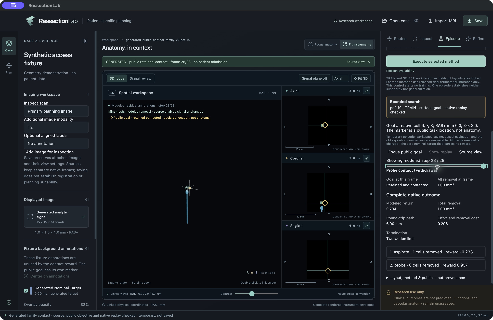
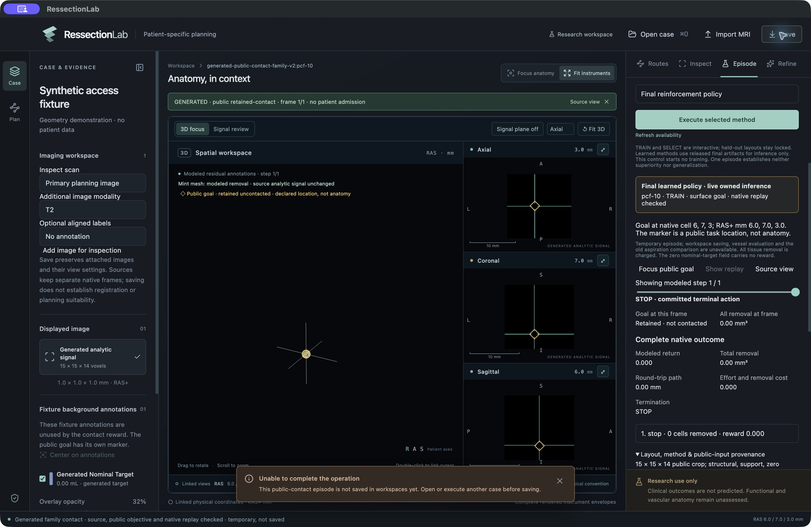

# Actual contact-family workflow in the Mac app

Root exercised SEARCH, final IL32 and final RL32 on the same generated pcf-10 surface TRAIN goal through Electron. SEARCH executed aspiration followed by probe, reached the retained goal and replayed all29 frames (return+0.704). IL and RL each loaded their correct final checkpoint, made one inference call and immediately stopped (return0). All workers exited cleanly with zero optimizer updates; independent saved-result review confirms the identities and outcomes.

The UI showed the actual negative learned behavior, method/checkpoint provenance, removal accounting and public goal state. Eight held-out layouts were visibly disabled. Save refused the temporary contact episode with an explicit explanation before a save dialog. Contact-family workspace persistence remains unsupported.

The first search screenshot exposed a clipped long probe. After the independently reviewed camera correction and77 passing viewer controls, root ran one separate SEARCH camera regression. At the final frame, the whole probe was visible without manual refitting; the sealed action history and outcome were unchanged. This fourth execution is a UI regression, not another benchmark replicate. Both Electron sessions exited normally. The tested working build includes preserved neighboring UI work; source tests and earlier exact-index builds separately cover committed integration.

The screenshots show generated software behavior only. Neither physical contact realism, patient transfer nor RL superiority follows.

