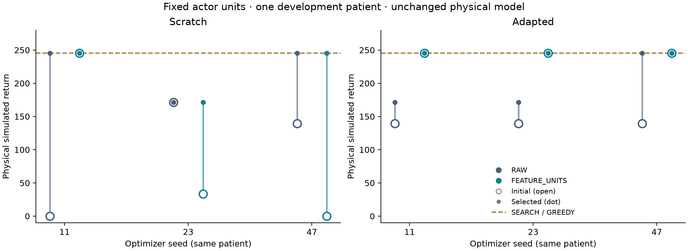

# Native actor feature-unit study

Fixed feature units raised this run’s procedural frozen-policy return from **139.62 to 245.24**, matching SEARCH. Every FEATURE_UNITS adaptation run retained that initial frozen checkpoint: the higher selected starting policy did not yield demonstrated additional patient-specific adaptation gain. All twelve actors received real updates; no learned arm exceeded the search value of 245.24.

This is a completed, preregistered two-profile development comparison in one previously explored patient-derived structural case. Pretraining used two procedural families and **zero human patients**. Three optimizer seeds are repeats within this case, not independent patients. Geometry/actions/tools, physical reward definitions, critic architecture and input/output units, loss weights, clipping and optimizer settings were fixed; only actor input units differed.

| Mode | Profile | Seed | Initial → selected return | Selected initial? | Adam updates | Optimization / selection transitions | Online seconds | Full arm seconds* |
|---|---|---:|---:|---|---:|---:|---:|---:|
| Scratch | RAW | 11 | 0.00 → 245.24 | No | 14 | 68 / 43 | 30.100 | 33.116 |
| Scratch | FEATURE_UNITS | 11 | 245.24 → 245.24 | Yes | 14 | 67 / 44 | 30.161 | 33.957 |
| Scratch | RAW | 23 | 171.42 → 171.42 | Yes | 12 | 66 / 37 | 30.125 | 34.100 |
| Scratch | FEATURE_UNITS | 23 | 33.40 → 171.42 | No | 14 | 62 / 47 | 30.027 | 34.032 |
| Scratch | RAW | 47 | 139.62 → 245.16 | No | 12 | 65 / 38 | 30.034 | 33.987 |
| Scratch | FEATURE_UNITS | 47 | 0.00 → 245.24 | No | 15 | 75 / 40 | 30.077 | 33.111 |
| Adapted | RAW | 11 | 139.62 → 171.42 | No | 12 | 63 / 42 | 30.302 | 33.699 |
| Adapted | FEATURE_UNITS | 11 | 245.24 → 245.24 | Yes | 12 | 66 / 41 | 30.340 | 33.611 |
| Adapted | RAW | 23 | 139.62 → 171.42 | No | 11 | 65 / 36 | 30.199 | 33.616 |
| Adapted | FEATURE_UNITS | 23 | 245.24 → 245.24 | Yes | 12 | 67 / 38 | 30.041 | 33.325 |
| Adapted | RAW | 47 | 139.62 → 245.17 | No | 10 | 64 / 36 | 30.202 | 33.517 |
| Adapted | FEATURE_UNITS | 47 | 245.24 → 245.24 | Yes | 12 | 66 / 42 | 30.046 | 33.391 |

*Full arm time includes cold simulator preparation, policy/checkpoint/optimizer initialization, training, selection, reporting and candidate extraction; independent geometry auditing and shared offline pretraining are separately charged below.

FEATURE_UNITS-minus-RAW selected returns for seeds 11/23/47 are **[0.00, 0.00, 0.08] for scratch** and **[73.82, 73.82, 0.07] for adaptation**. Scratch therefore shows only a 0.08 return difference in one seed at the selection endpoint. Initial behaviors differ substantially despite paired trainable tensors: scaled scratch seed 11 starts at the search value, while scaled seeds 23 and 47 improve from 33.40 and 0.00. The design tests the whole feature-unit pipeline; it cannot attribute the frozen-policy difference separately to initialization versus offline learning.

| Offline pretraining | Adam updates | Optimization / selection transitions | Optimization + selection s | Initialization s | Preparation s | Inner total s | Full call s |
|---|---:|---:|---:|---:|---:|---:|---:|
| RAW | 32 | 169 / 188 | 29.403 | 0.855 | 0.354 | 30.628 | 30.630 |
| FEATURE_UNITS | 32 | 159 / 188 | 27.351 | 0.087 | 0.317 | 27.772 | 27.773 |

The inner total includes the module’s export; the full call includes caller overhead. Offline pretraining is additional to every patient-arm comparison and is not hidden inside an inference-only speed claim. Fixed order also leaves process/library warm-up effects observable in initialization costs.

| Shared baseline / frozen policy | Return | Search / optimization transitions | Selection transitions | Algorithm seconds | Cold preparation s | Checkpoint initialization s | Full arm s* |
|---|---:|---:|---:|---:|---:|---:|---:|
| GREEDY | 245.24 | 2 | 0 | 0.781 | 2.024 | — | 2.807 |
| SEARCH | 245.24 | 21 | 0 | 6.127 | 2.091 | — | 8.222 |
| RAW frozen | 139.62 | 0 | 6 | 1.978 | 1.995 | 1.066 | 5.073 |
| FEATURE_UNITS frozen | 245.24 | 0 | 6 | 1.818 | 1.908 | 0.997 | 4.761 |

The primary comparison matches 30-second cooperative optimization-plus-selection allowances, not executed updates or total transitions. Actual online updates ranged from 10 to 15; 32 was a cap. Selection transitions are additional to the 256-optimization-transition cap. Online overshoot was 0.027–0.340 s. Per-arm receipts separate initial selection, later/partial selection, final checkpoint export, setup and residual reporting costs. Shared geometry baselines were run once and reused explicitly across profiles.

All **23 candidate identities passed independent native checks**, using 9 distinct sequence audits. The denominator includes three shared geometry baselines, six scratch initial policies, twelve selected policies and two frozen policies; no failed or unfinished arm was omitted. Full validation took 43.904 s, including approximately 11.951 s beyond measured candidate work in serialization and other overhead.

At the initial permitted optimization state, RAW actor tanh activations exceeded |0.95| for 52.5%–65.0% of recorded hidden activations across all candidate rows including STOP; FEATURE_UNITS recorded 0.0%. These diagnostics used the actual transformed input path and no extra transitions or gradients. Reduced saturation is observed, but the comparison does not establish saturation as the sole mechanism; critic state aliasing and reward-gradient balance were unchanged.

SEARCH removes 249 mm³ labeled target and 17 mm³ modeled normal tissue. Its 32 mm³ cumulative partial normal contact remains separate from removal. Modeled residual target is 41,670 mm³. The fixed proposal inventory supports only a bounded route slice, not a complete resection plan.

Motor and language evidence remain absent and clinical deficit probabilities are null. The structural mirror’s official TCIA byte equivalence is unverified, the working brain envelope is an unreviewed estimate, and access is hypothetical. All perturbations were zero; final/stress worlds remained unopened. No clinical-safety, uncertainty-calibration, unseen-patient or population-generalization claim follows.

Total launcher time was 534.183 s; study time was 529.909 s. Heavy parallel tests/resampling were paused, but normal desktop/OS background activity was uncontrolled. Peak recorded worker RSS was 2.573 GiB. These are observed local timings, not isolated-machine latency guarantees.

Execution used commit `0bffeaa33dc3120183d0c6fb124aff6e2d327a63`, archive SHA256 `f46356427bc270428984bd7f3e518e7946212c68ec0972111e4004fb10579cb9`, numerical runtime `sha256:850dab806bca81be6d18f25cc39643e76d7cf1621d7cbad1f96669228fed65fa`, and declaration `sha256:b19aac85f9241e37b98ae53d539ad923f3258bf42a106d67e520f37abcf6a237`. The tested archive passed 794 Python checks and actual public-case preflight before release. Both launcher and worker Git discovery were bounded to avoid mutable outer-repository metadata. Source snapshots, checkpoint/profile identities and raw records were retained without outcome-driven changes.

This report and plot are generated by `report.py`; checksums are in `report-source.json`. Large native replay histories are preserved locally and may be read from the versioned lossless gzip, with byte/semantic roundtrip evidence in the adjacent `replay-storage.json`. No completed numerical record is modified by reporting.
