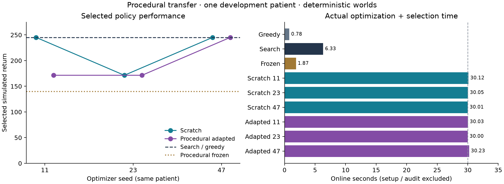

# Procedural-to-patient development attempt v2

The completed attempt demonstrates actual patient-specific updates and independently checked native removal. Search remains the strongest result in this declared action model; procedural pretraining does not establish an advantage over scratch learning.

This is one previously explored patient-derived development case, two procedural source families, and zero human pretraining patients. The three seeds are optimizer repeats within this patient, not three independent patients. Motor and language evidence are absent; clinical deficit probabilities are null. All world perturbations are zero, and final/stress worlds remain unopened.

| Method | Seed | Selected simulated return | Adam updates | Optimization/search transitions | Selection transitions | Online seconds |
|---|---:|---:|---:|---:|---:|---:|
| GREEDY | — | 245.24 | 0 | 2 | 0 | 0.782 |
| SEARCH | — | 245.24 | 0 | 21 | 0 | 6.330 |
| Procedural frozen | — | 139.62 | 0 | 0 | 6 | 1.870 |
| Scratch | 11 | 245.24 | 14 | 68 | 43 | 30.118 |
| Scratch | 23 | 171.42 | 11 | 66 | 36 | 30.051 |
| Scratch | 47 | 245.16 | 12 | 65 | 38 | 30.009 |
| Procedural adapted | 11 | 171.42 | 12 | 61 | 42 | 30.034 |
| Procedural adapted | 23 | 171.42 | 10 | 63 | 36 | 30.003 |
| Procedural adapted | 47 | 245.17 | 10 | 64 | 36 | 30.226 |

Online seconds are optimization plus selection (including initial selection); the frozen row measures its complete selection panel. Search and greedy terminated after exhausting/stopping their declared search, rather than consuming the whole allowance. Cold simulator setup, model/checkpoint initialization, extraction and validation are separate. Each scratch/adapted arm had a 30 s cooperative cap, 32-update cap, and 256-optimization-transition cap; selection transitions are additional. The wall-time allowance is matched, not the total transitions or executed Adam steps.

Scratch initial returns were [0.00, 171.42, 139.62]. Seed 23 retained its initial checkpoint; seeds 11 and 47 improved. All adapted runs started from the identical shared policy at 139.62 and selected updated checkpoints. All six actors changed, including the run whose selected checkpoint stayed initial. No learned arm exceeded search. The adapted-minus-scratch returns for seeds 11/23/47 are [-73.82, 0.00, 0.01]; these are descriptive optimizer differences in one case.

Fresh procedural pretraining used 32 Adam updates, 169 optimization transitions and 188 selection transitions. Its total measured cost was 31.216 s, including 29.990 s optimization/selection, 0.896 s initialization and 0.313 s preparation. The full pretraining wrapper call was 31.218 s; the 31.216 s inner total excludes that small caller overhead. These costs are additional to patient adaptation.

Cooperative online wall overshoot ranged from 0.003 to 0.226 s. Cold setup took 1.942–2.021 s per learned arm. Scratch initialization took 0.038–0.041 s; adapted initialization took 0.379–0.387 s. Frozen shared validation/loading was separately measured at 1.003 s. These phase times must not be described as end-to-end latency.

All 13 frozen candidates passed independent native containment, frontier and complete-tool checks, using 8 distinct sequence audits. Full validation took 33.124 s. Search removes 249 mm³ of labeled target and 17 mm³ of modeled normal tissue; its cumulative partial normal contact is 32 mm³, recorded separately from removal. Its modeled residual target is 41,670 mm³: this bounded route slice is not a complete resection plan.

Other agents paused heavy tests and resampling during timed execution. Normal desktop and operating-system background activity remained uncontrolled; saved load averages and process peak RSS describe observed conditions, not isolated-machine timing. The worker peak RSS reached 3.317 GiB. Validation spent about 3.616 s beyond measured candidate work in serialization and other overhead.

The source is a public structural mirror of UCSF-PDGM-0004; equivalence to official TCIA bytes remains unverified. The working brain envelope is an unreviewed estimate, access is hypothetical, and the finite native action inventory is deliberately small. These results do not validate clinical safety, uncertainty robustness, population generalization or a complete surgery workflow.

The launcher completed in 288.873 s. Execution used committed source `68e4fde13b1fa13411e59af663bd17ae63885947`, numerical runtime `sha256:e1186e12e79263c41e3cdad06112012702b4126a73fd912c14fa1e41d6d8843f`, the unchanged v1 scientific declaration, and the v2 implementation-repair attempt record. The failed v1 attempt is retained beside this directory and supplies no comparative result. Settings were not changed after this completed outcome.

The full native replay is retained locally and also versioned as lossless gzip with byte-for-byte roundtrip, SHA256 and size evidence in `replay-storage.json` beside the compressed file. No completed experiment record was changed.

The plot and this report are generated from retained JSON by `report.py`; source checksums are in `report-source.json`. All native replays, selected checkpoints, complete selection records, source snapshots and phase costs remain available in this directory.
