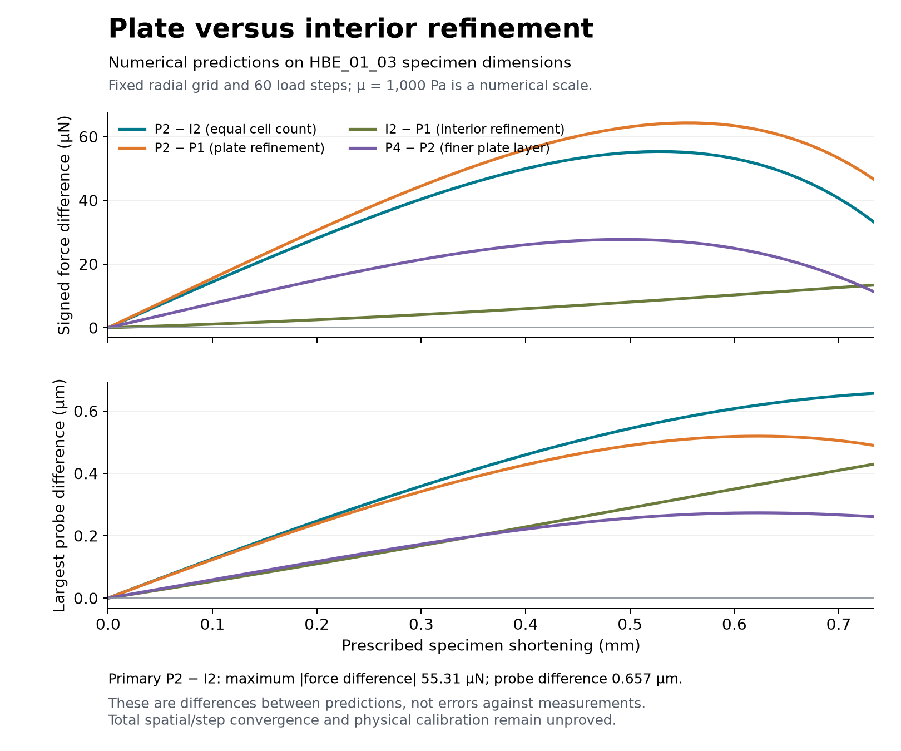

# Fixed-N24 boundary diagnostic

The three declared native runs completed and passed their individual numerical
checks. [Independent replay](independent-review.json) reconstructed P1 and all
three new histories, **244 states**, with zero complete-record mismatches.
The earlier global spatial comparison remains failed. Calibration is closed.

| Declared comparison | Endpoint force difference | Largest force difference | Largest probe difference |
|---|---:|---:|---:|
| P2 − I2, equal cell count | +33.166 µN | 55.308 µN | 0.657 µm |
| P2 − P1, plate refinement | +46.540 µN | 64.287 µN | 0.519 µm |
| I2 − P1, interior refinement | +13.374 µN | 13.374 µN | 0.429 µm |
| P4 − P2, finer plate layer | +11.280 µN | 27.712 µN | 0.273 µm |

The plate sequence has signed endpoint local order **2.0447** and a conditional
remaining indicator of **3.608 µN**. Both apply with the radial, circumferential
and other axial cells fixed. They are not total continuum-error estimates.
The larger effect near the plate supports boundary sensitivity; it does not
prove a singularity or eliminate shared spatial error.

These are numerical predictions on HBE_01_03 measured specimen dimensions.
The homogeneous material law, no-slip plates, symmetry, and μ = 1,000 Pa remain
declared assumptions/a numerical scale. No measured response curve was opened
and no material parameter was fitted. The regional energy calculation uses
element-average density times regional volume, rather than exact subelement
energy. Stress and nodal traction summaries retain their proxy meanings.

## Execution and preservation

Preparation took **25.635 s**, with **637,337,600 B** sampled peak process-group
RSS and **71,245,700 B** final output. Its independent artifact review verified
all three prepared variants and 179 input/source hashes without native calls.

The separately released solve phase took **739.194 s** of 1,200 allowed, with
**1,176,420,352 B** sampled peak RSS and **826,166,526 B** final output. Native
runs took 144.257 / 165.317 / 257.533 s, each below 420 s. The active-output
maximum was 293,289,328 B, below 512 MiB. Sampled memory/output observations
may miss between-sample peaks. There were exactly three native calls and no
mesher calls or retries. Independent review verified 201 unchanged input hashes,
27 retained native files and the 22-file executing archive.

The source archive remains bound to commit `a85261b`; compact preparation/solve
receipts and [the complete comparison](comparison.json) are retained here.
Raw solver histories remain under the paths in [solve-state.json](solve-state.json).
The figure script reads only two hash-pinned saved outputs; it never invokes a
solver or opens measured response data. [PDF figure](comparison.pdf).

Next: prospectively test the remaining global spatial trend with one bounded
N32 compression run, after its numerical analysis and resource declaration are
reviewed. No automatic further refinement follows a failure. Finest-level load-
step checks and eventual held-out measured-response validation remain required.
This result does not authorize calibration, patient-specific force predictions
or surgical RL trajectories.
