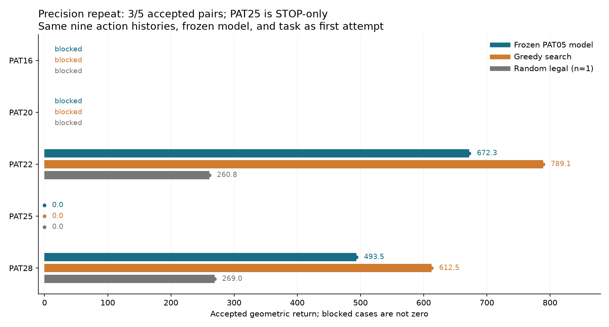

# Precision-only repeat: frozen PAT05 model on remaining TRAIN patients

All nine completed episodes across the three prepared patients passed independent native geometry and volume/reward accounting. PAT16 and PAT20 remained blocked. Greedy search exceeded the frozen model on both cases with legal non-STOP actions; PAT25 remained STOP-only. No training, adaptation, checkpoint selection, or further retry occurred.

| Patient | Frozen model return | Greedy return | Random return (one episode) | Disposition |
|---|---:|---:|---:|---|
| PAT16 | — | — | — | Blocked: 19 supplied target cells outside support |
| PAT20 | — | — | — | Blocked: 125 supplied target cells outside support |
| PAT22 | 672.297 | 789.097 | 260.798 | All three episodes accepted |
| PAT25 | 0.000 | 0.000 | 0.000 | Only STOP legal; all 78 previews failed shaft clearance |
| PAT28 | 493.534 | 612.538 | 268.986 | All three episodes accepted |

A dash means unassessed, never zero. There are three accepted primary pairs out of five prescribed patients, but only two pairs exercise a non-STOP policy choice. Random seed 200011 supplies one diagnostic trajectory per prepared case, not an estimate of typical random performance.

| Patient / method | Target removed (mm³) | Normal removed (mm³) | Fraction of complete target | Path (mm) |
|---|---:|---:|---:|---:|
| PAT22 / frozen | 697.998 | 127.000 | 5.016% | 211.000 |
| PAT22 / greedy | 819.998 | 153.000 | 5.893% | 211.000 |
| PAT22 / random | 271.999 | 55.000 | 1.955% | 81.000 |
| PAT28 / frozen | 530.999 | 186.000 | 5.171% | 175.000 |
| PAT28 / greedy | 643.999 | 156.000 | 6.271% | 171.000 |
| PAT28 / random | 290.999 | 109.000 | 2.834% | 123.000 |

Frozen-minus-greedy return was −116.800 on PAT22 and −119.004 on PAT28. The PAT28 model removed less target and more normal tissue than greedy. Partial-contact cost remains zero in the frozen geometric reward and contact is reported separately; none of these scores is a clinical deficit estimate.

The repeat changed only the measured aggregation precision in `native_spatial_task.py` and `native_spatial_evaluation.py`. The original support acknowledgment timestamp, checkpoint bytes, patient order, roles, access rule, settings and random seed are identical. All five saved preparation records match exactly except timing. Across all nine completed trajectories, action IDs/order/masks, observed inputs, chosen actions, frozen logits/probabilities/values, removed/contact cells, microsteps, complete-tool geometry and provenance match the first attempt exactly. Only saved target/normal/reward arithmetic and measured durations changed. `attempt-comparison.json` records these assertions and input hashes.

This is a new execution after a precision correction, not a reinterpretation of the old attempt. Its three previously failed/null method outcomes remain failed/null in the original directory and original archive. The new nine native checks and the independent saved-record review pass separately. The largest per-episode change in the saved simulator return is 0.000026317, with no change to behavior.

The model is still the 30,827-parameter PAT05 visited-imitation checkpoint, with parameter hash `74e90d9487dff6fe9db83c92e3887f15533e0499abaac386a73bbd7d4d566b4e`. This is development transfer from one training patient, not population pretraining or held-out efficacy. It ranks certified proposals from annotation-assisted input. The actor crop includes every supplied target cell on the three prepared cases; greedy still uses full nominal source fields. Initial accepted proposal envelopes exclude 10,186/13,915 PAT22 and 7,509/10,269 PAT28 target centers. PAT25 has no legal non-STOP proposal. Support was not expanded and targets were not clipped for the blocked cases.

| Patient | Shared preparation (s) | Frozen method (s) | Greedy plan + replay/audit (s) | Random method (s) | Whole supervised worker (s) |
|---|---:|---:|---:|---:|---:|
| PAT16 | 0.455 | — | — | — | 3.578 |
| PAT20 | 0.395 | — | — | — | 2.508 |
| PAT22 | 10.027 | 21.258 | 35.536 | 13.680 | 82.889 |
| PAT25 | 2.585 | 1.216 | 0.952 | 0.698 | 7.984 |
| PAT28 | 9.889 | 19.741 | 33.283 | 17.031 | 82.324 |

Summed supervised patient time was 179.283 s, with maximum sampled worker RSS 1,585,463,296 bytes. Every worker finished within 180 s / 6 GiB. Methods ran frozen, greedy, then random. RSS sampling can miss transient peaks.

PAT22/PAT28 actor forwards took 1.228/1.175 s, versus full frozen methods of 21.258/19.741 s; native transitions and successor inventories consumed 13.211/12.832 s, and independent audits 4.236/3.534 s. Shared preparation is charged separately above. Greedy planning took 15.889/15.030 s before its full replays. These are single-run costs and exclude prior PAT05 training; no amortized speed or clinical benefit is established.

Source commit `7ea85f5` and the exact declaration (`9981dd90217e57b1fd8c6ff62580e9c1c7c9cefe991537e8b056ec68ab4756a5`) were frozen before execution. All original execution files, the source snapshot and copied checkpoint are retained in `completed-run.tar.gz`, verified byte-for-byte. `summary.json` and `output-sha256.json` are unchanged execution records. The separate compact report and old/new comparison do not load patient arrays or perform policy forwards.

