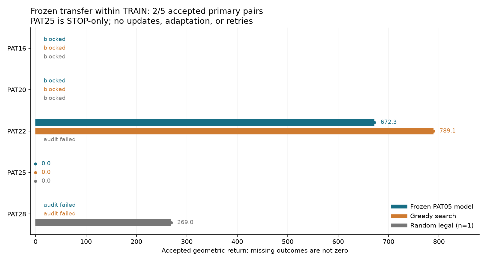

# Frozen PAT05 model on the five remaining TRAIN patients

The first attempt produced two accepted primary pairs out of five prescribed patients; only PAT22 supplied an accepted primary comparison with non-STOP actions. The frozen model remained below greedy search on that case. No optimizer steps, adaptation, selection-patient access, or retries occurred.

| Patient | Frozen policy return | Greedy return | Random return (one episode) | First-attempt disposition |
|---|---:|---:|---:|---|
| PAT16 | — | — | — | Blocked: 19 supplied target cells outside support |
| PAT20 | — | — | — | Blocked: 125 supplied target cells outside support |
| PAT22 | 672.297 | 789.097 | — | Primary pair accepted; random target-volume accounting failed |
| PAT25 | 0.000 | 0.000 | 0.000 | Only STOP legal; all 78 previews failed shaft clearance |
| PAT28 | — | — | 268.986 | Both primary normal-volume accounting checks failed; random accepted |

A dash means unassessed, never a zero. Failed method receipts retain the completed native history and failure reason. Their unaccepted simulator totals are excluded from comparison. The independent saved-record check confirmed all five cases, six accepted episodes, and three failed/null episodes; it did not rerun native geometry.

On PAT22, the frozen model removed 697.998 mm³ of target and 127.000 mm³ of normal tissue, versus 819.998 and 153.000 mm³ for greedy. Target fractions were 5.016% and 5.893% of the complete 13,914.959 mm³ supplied annotation. The model’s return gap was −116.800. Both paths totaled 211.000 mm, with no tool changes. Partial contact has zero reward weight in this declared geometric task and is reported separately; it is not an injury probability.

The three prepared cases included all supplied target cells in the 64³ actor crop. That does not imply proposal coverage: initially 10,186/13,915 PAT22 target centers and 7,509/10,269 PAT28 target centers lay outside the accepted proposal AABB. PAT25 had no accepted non-STOP proposal. The fixed access rule and generic tools therefore remain substantial task limitations. Support was neither expanded nor target-clipped for blocked cases.

The 30,827-parameter spatial model is the fixed visited-imitation checkpoint trained only on PAT05. It ranks certified geometric candidates using a supplied annotation, scan, cavity and tool geometry. Greedy receives the same permitted annotation but scores the full nominal source fields, while the CNN uses its crop. This is development transfer from one training patient, not population pretraining, scan-only inference, or held-out clinical efficacy.

| Patient | Preparation (s) | Frozen method (s) | Greedy plan + replay/audit (s) | Random method (s) | Whole supervised worker (s) |
|---|---:|---:|---:|---:|---:|
| PAT16 | 0.444 | — | — | — | 2.956 |
| PAT20 | 0.394 | — | — | — | 2.528 |
| PAT22 | 7.587 | 20.331 | 34.973 | 13.975 | 79.222 |
| PAT25 | 2.469 | 1.201 | 0.956 | 0.693 | 7.792 |
| PAT28 | 7.845 | 19.123 | 32.697 | 16.879 | 78.986 |

All five supervised workers finished within their 180 s / 6 GiB limits: summed supervision was 171.484 s, and the maximum sampled RSS was 1,801,928,704 bytes. Sampling can miss transient peaks. No timeout or automatic retry occurred. Methods ran frozen, greedy, then optional random, with random seed 200011. Failed-method time remains charged.

PAT22 policy forwards used 0.934 s, but its full method took 20.331 s, including 12.795 s native transitions/inventory and 4.043 s independent audit, plus separately reported shared preparation of 7.587 s. Greedy planning took 15.174 s and its complete method 34.973 s. These measurements do not include prior PAT05 training costs and do not establish an amortized speed advantage.

The source/checkpoint closure passed after every patient; the checkpoint parameter hash remained `74e90d9487dff6fe9db83c92e3887f15533e0499abaac386a73bbd7d4d566b4e`. The numerical source snapshot, exact declaration, copied checkpoint, all successful and failed receipts, and original output index are retained in `completed-run.tar.gz`, verified byte-for-byte against the raw files. `summary.json` and `output-sha256.json` remain original execution records. Later precision diagnosis or repair does not retroactively change this attempt.

The pre-execution integrated check first reported 31 passed / 1 failed because the restricted Torch loader rejected NumPy scalar architecture metadata. A narrow hash-verified local-checkpoint loader correction yielded 32 passed in 2.10 s before this run. See `verification.json` for the provenance and exact targets.

