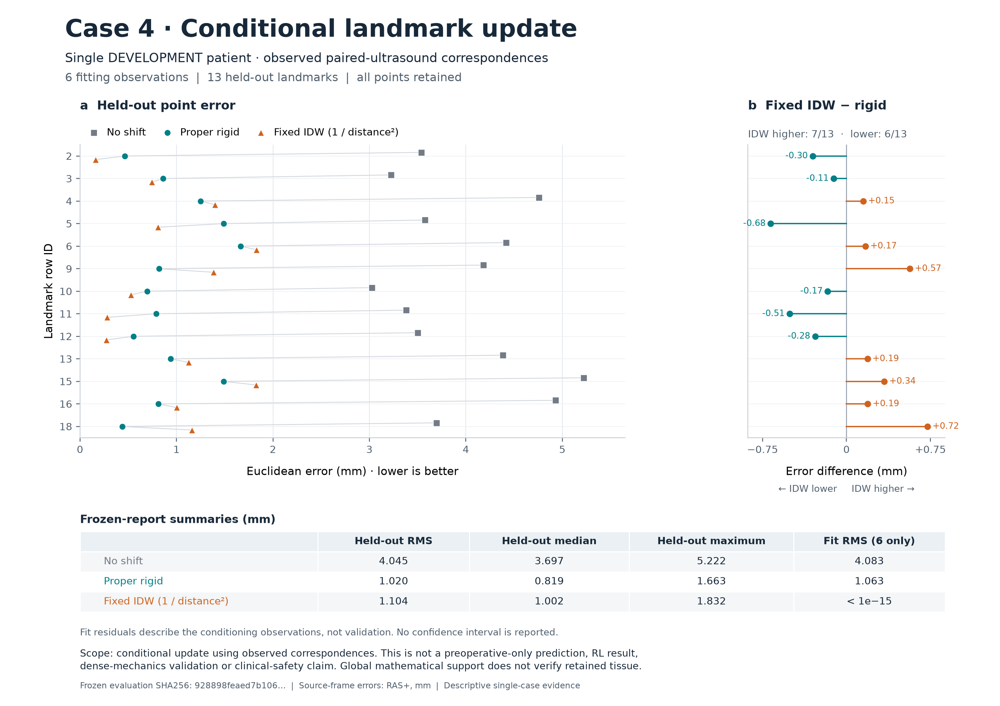

# RESECT Case4 observed ultrasound correspondence update

All three separately released stages completed and passed independent review.
On this single DEVELOPMENT patient, proper-rigid correction reduced held-out
RMS correspondence error from **4.044969 mm to 1.020253 mm**. Six actual
intraoperative correspondences conditioned the frozen methods; all thirteen
withheld landmark rows were evaluated once without exclusion or retuning.
This is conditional image-update evidence, not a scan-only prediction.

| Frozen method | Held-out RMS (mm) | Median (mm) | Maximum (mm) | Six-point fitting RMS (mm) |
|---|---:|---:|---:|---:|
| No update | 4.044969 | 3.697382 | 5.221901 | 4.083348 |
| Proper rigid | 1.020253 | 0.818729 | 1.663311 | 1.062794 |
| Fixed inverse-distance squared, all six | 1.104199 | 1.001597 | 1.831521 | < 1e-15 |

The preregistered primary RMS difference, rigid minus no update, is
**−3.024716 mm**. IDW has larger errors than rigid at seven points and smaller
errors at six; its exact fitting interpolation does not ensure better validation.
These are descriptive points from one person, not thirteen independent patients.
No confidence interval, clinical threshold or V-selected method promotion follows.

## What was independently verified

The original US images retain their exact bytes and different oblique grids.
Independent bounded header parsing verified millimetres, sform1/qform0 and the
complete affine matrices without opening image arrays. All nineteen source
points and nineteen observed destinations lie inside their respective image
voxel-centre boxes, checked through inverse affines. Source-point extent is
12.867702 × 34.621691 × 30.963398 mm. Image extent is not proof of retained-tissue,
cavity or whole-brain support.

A second evaluator parsed the original nineteen-row tag and reconstructed the
rigid rotation through a quaternion eigenproblem, independently of production
SVD. It recomputed IDW, every V point error, paired differences and the separate
B residuals. Maximum numerical disagreement was **8.53e-14 mm**. Committed code,
runtime, original tag fixity, fixed partition, complete-field freeze and the
single validation-reveal marker all passed review.

[Header review](header-review/verification.json),
[evaluation review](evaluation-review/verification.json),
[frozen field](fit-freeze/comparison/prediction-field.json),
[full metrics](fit-freeze/comparison/evaluation.json),
[PDF figure](case4-held-out-landmark-errors.pdf).

| Stage | Supervised wall time (s) | Observed worker peak RSS (bytes) |
|---|---:|---:|
| Header QC | 0.607010 | 46,858,240 |
| Fit and freeze | 0.543881 | 40,091,648 |
| Held-out evaluation | 0.848790 | 40,042,496 |

Each phase stayed within its 30-second allowance and 1-MiB per-file limit.
Reported memory is observed, not a hard limit. Parent preflight and final
receipt publication are outside the supervised timing scope. These are single
executions, not a comparative latency benchmark.

## Reproduction and remaining scope

Executed source commit: `694022d13394ec9c2a28f0b56fcf1e00289321af`.
The [declaration](../../manifests/experiments/resect-case4-sparse-update-v1.json)
and `releases/` bind the exact separate stage invocations. The runner refuses
repeating any phase in the historical output directories. Do not replace the
frozen fields, reopen V for tuning, or relabel this patient as untouched evaluation.

`plot.py` regenerates the figure from the hash-pinned saved report without
original patient access or fitting. The byte-preserved `evaluation-review/review.py`
is a historical audit: its original `build/` location, header-review path,
recorded absolute runtime and file-mtime chronology are prerequisites. Copying
artifacts may invalidate those historical filesystem assertions even when the
numerical values reproduce. Its exclusive output cannot overwrite the saved
review. Numerical reproduction and historical chronology are separate checks.

Root preparation passed 70 focused tests. Independent review found and verified
repairs for inconsistent deadline acceptance and weak predecessor binding; the
original negative evidence remains in `preparation-review/`. Runtime review
passed four targeted regressions and four independent controls. The header
review also preserves its corrected reviewer-only axis-label assumption.

The result does not establish dense deformation, cutting forces, removal,
cavity/brain support, physical clearance, neurological benefit or complete
Objective 4A decision integration. No MRI transfer, FEM, generated observations,
training or RL transitions were used. Earlier mesh/registration failures remain
failed. Case4 remains DEVELOPMENT, and its thirteen V points are now consumed
for any future chosen or tuned method. Next: connect released observations to
state/replay and stale-result invalidation while preserving unsupported decisions.
