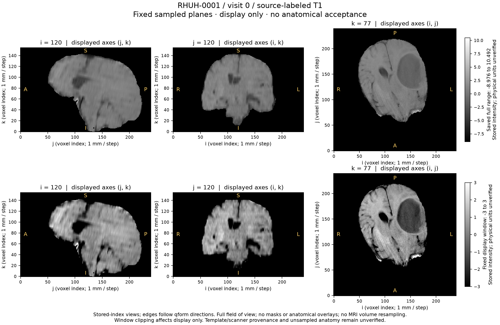

# First RHUH MRI: fixed-plane display and unresolved coverage

One separately released rendering completed in **1.696 seconds**, with a sampled
worker peak of **302,055,424 bytes** across eight samples. Original bytes and all
13 archived source/review files stayed unchanged. The worker exited successfully;
there was no retry, new acquisition, segmentation, patient import or training.

The figure shows the prospectively fixed native planes i=120, j=120 and k=77.
The same stored values appear under the saved full-range window and the fixed
[-3, 3] display window. Full array extents, qform direction labels and 1-mm
physical aspect are retained. The renderer reused the reviewed decoder twice on
the same immutable compressed snapshot; it did not resample the MRI volume.

Both root and a separate reviewer inspected the saved PNG. The six panels and
labels are readable and the three planes show nonempty anatomical structure.
Visible tissue approaches or touches the inferior k=0 boundary in the i=120 view;
full inferior anatomical coverage remains unresolved. The dark region at the
display-right of the k=77 view is unclassified. It is not accepted as a surgical
cavity, injury label or particular pathology. See [visual review](VISUAL_QC.md).

The independent saved-result audit passed on its first execution. It reconciled
the committed release, exact source archive, original compressed bytes, output
hashes, parent completion and fixed-plane/window/orientation arithmetic without
decoding the MRI or rendering again. Pixel interpretation and unsampled anatomy
are outside that audit. Scientific planning use, anatomical registration, support
mask validity and clinical interpretation remain unaccepted.

Source: RHUH-0001 visit 0, source-labeled T1, from the
[RHUH-GBM collection](https://www.cancerimagingarchive.net/collection/rhuh-gbm/).
The original public file and processing uncertainty remain documented in
[processing reconciliation](../../docs/rhuh-first-image-processing-reconciliation.md).

