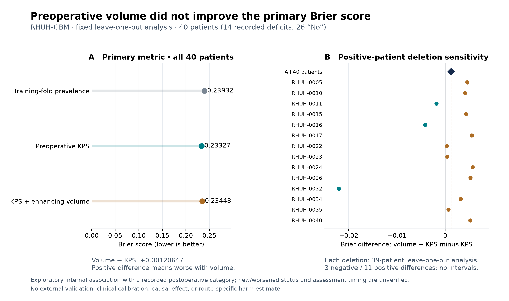

# RHUH-GBM preoperative observational baseline

Adding preoperative enhancing tumor volume did **not** improve the prespecified primary score over preoperative KPS alone: paired Brier difference (KPS + volume minus KPS) **+0.00120647**, where positive means worse. All 40 patients contributed one held-out prediction per model. The single prospectively released run completed all 9,092 logistic fits, 99 label permutations and 14 positive-patient deletion analyses, without retry or model selection.

| Fixed model | Brier, n=40 ↓ | Pooled AUC | Correct / 40 | Detected / 14 recorded positives |
|---|---:|---:|---:|---:|
| Training-fold prevalence | 0.23931624 | Not reported¹ | 26 | 0 |
| Preoperative KPS | 0.23327217 | 0.51373626 | 26 | 2 |
| KPS + preoperative enhancing volume | 0.23447864 | 0.60714286 | 27 | 3 |

¹ Leave-one-out training prevalence inversely depends on the omitted label; its pooled AUC would be an artifact. Classification uses the declared 0.5 threshold. Both logistic models had 2 false positives; accuracy is limited by the 26/40 negative-class majority. No confidence intervals or clinical calibration were established.

The diagnostic full-model minus prevalence difference was −0.00483760. Four of 99 fixed-seed unconditional label permutations were as low or lower, giving `(1 + 4) / 100 = 0.05`. This tests exchangeability of the labels for the whole preoperative feature set against prevalence; it does **not** test the incremental contribution of volume conditional on KPS. With only 99 draws, reported p-values have 0.01 resolution. The AUC increase and this diagnostic do not overturn the primary negative comparison.

Deleting each recorded-positive patient in turn and repeating 39-patient leave-one-out evaluation gave primary differences from **−0.02205100 to +0.00567622**: 3 negative, 11 positive, none zero. These are sensitivity analyses, not independent validation samples or confidence limits. Every deletion and all predictions remain in the lossless record; no favorable deletion was selected.

The endpoint is any **recorded postoperative deficit category**, combining 6 Transient, 6 Minor Persistent and 2 Major Persistent records against 26 No records. The source does not establish baseline neurologic domains, newly caused or worsened deficit, exact clinical assessment time, or a recovery trajectory. This is a small, previously inspected, single-center observational cohort. These two preoperative covariates are constant across alternative routes for the same patient; even a better prognostic baseline would not directly rank routes. Its purpose is a comparator for future observed-injury/location increments, not a planning reward or a calibrated clinical risk estimate.

Only the two declared preoperative projections entered the models. All 120 observed predictions were unchanged when excluded columns were cyclically rotated while patient IDs, target and permitted features stayed fixed; permitted projection hashes also matched. Training-only scaling was repeated within every fold. All fits completed in 5–9 iterations. The known scikit-learn `penalty='l2'` FutureWarning was retained 9,092 times; no convergence warning occurred. Earlier preparation failures—missing optional dependency, convergence-warning subclass handling and shared-runtime origin verification—remain preserved in their original runtime/review records; they were repaired before this sole actual experiment.

Evaluation took **11.566547 s**: observed 0.263697 s, permutations 9.950488 s and deletion diagnostics 1.351404 s. Worker time including setup and checks was **13.676998 s**; process supervision was **13.897940 s**, with sampled group peak **125.890625 MiB**. These are recorded intervals, not an isolated benchmark; brief memory peaks may escape sampling. Limits remained 180 s worker / 195 s supervisor, 1 GiB and one numerical thread. No paid service was used.

The 13 original output files (11,270,329 bytes) remain locally at `outputs/rhuh-preoperative-baseline-v1/run-01`. [outputs.tar.gz](outputs.tar.gz) losslessly preserves every file's bytes and relative path; [archive-verification.json](archive-verification.json) records roundtrip verification. All 3,660 bound source, release, data and numerical-runtime inputs remained unchanged. The original [source archive](source.tar.gz) is preserved; [compact-summary.json](compact-summary.json), [raw-output-index.json](raw-output-index.json) and [collection-receipt.json](collection-receipt.json) provide exact metrics and bindings.

The independent [saved-output audit](post-run-check.json) **passed** without refitting: 4,546 folds, 9,092 logistic predictions and 4,546 prevalence predictions were reconstructed, along with scalers, feature projections, excluded-field invariance and all metrics. Maximum probability discrepancy was 1.11 × 10⁻¹⁶ against a fixed absolute tolerance of 10⁻¹²; the largest checked discrepancy was scaler variance, 4.55 × 10⁻¹³. Source archive, runtime and raw-output hashes matched. This verifies the retained numerical record; saved coefficients alone do not independently prove optimizer optimality or clinical validity.

Data attribution: Cepeda, S., García-García, S., Arrese, I., Herrero, F., Escudero, T., Zamora, T., & Sarabia, R. (2023), *The Río Hortega University Hospital Glioblastoma dataset: a comprehensive collection of preoperative, early postoperative and recurrence MRI scans (RHUH-GBM)*, The Cancer Imaging Archive, [doi:10.7937/4545-c905](https://doi.org/10.7937/4545-c905); [dataset paper](https://pmc.ncbi.nlm.nih.gov/articles/PMC10551826/). The public clinical CSV is released under [CC BY 4.0](https://creativecommons.org/licenses/by/4.0/). Model outputs and plots are derived analyses; source CSV bytes were retained unchanged. Detailed definitions and discrepancies are preserved in [the clinical audit](../../docs/rhuh-outcome-audit.md). This saved-output report adds no model refits or new patient acquisitions.
