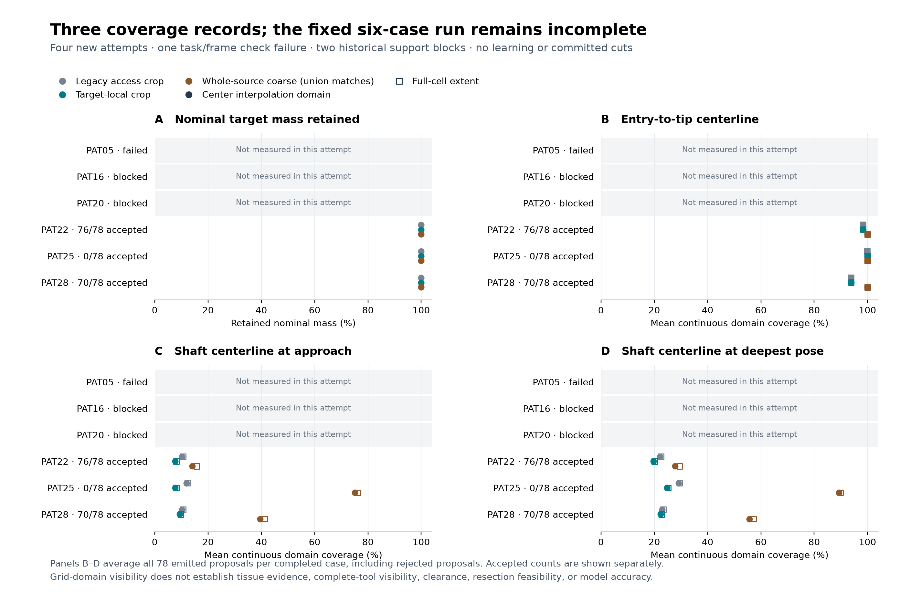

# Fixed TRAIN observation coverage: incomplete single attempt

The fixed six-case diagnostic produced **three new coverage records from four attempted cases**. PAT05 failed its task/frame identity check after 78 initial previews; PAT16 and PAT20 retained their historical support conflicts without new decoding. The overall worker status is **incomplete** and the process exited 1. No retry occurred. The three completed cases describe representation coverage only; they do not turn the whole run into a pass.

| Fixed TRAIN case | This attempt | Initial previews | Accepted / emitted proposals | New representation metrics |
|---|---|---:|---:|---|
| PAT05 | Failed: `PAT05 physical task or native frame changed` | 78 | Not recorded | Null |
| PAT16 | Historical support block: 19 target source cells outside support | None | Not attempted | Null |
| PAT20 | Historical support block: 125 target source cells outside support | None | Not attempted | Null |
| PAT22 | Coverage complete | 78 | 76 / 78 | Retained below |
| PAT25 | Coverage complete | 78 | 0 / 78 | Retained below |
| PAT28 | Coverage complete | 78 | 70 / 78 | Retained below |

PAT25's 78 proposals remain rejected for shaft contact with remaining native tissue; its accepted-subset coverage is **null**, not zero. PAT22 and PAT28 retain 2 and 8 working-reach rejections, respectively. New views did not change any completed task's physical catalog, legacy observation, cavity state or task-array fingerprints. A diagnostic record for rejected proposals does not make those proposals feasible.

The saved-only [PAT05 diagnosis](pat05-wrapper-diagnosis.json) identifies a wrapper comparison between a complete 20-field runtime record and an eight-field declared subset. The historical complete record projects exactly onto those eight original fields. This schema mismatch necessarily rejects; it does **not** prove changed patient geometry. The failed run did not retain its actual complete grid values, so current-run numerical equality remains unverified. PAT05 stays failed/null, with no repair or rerun folded into this attempt.

## Target mass and continuous visibility

Legacy and target-local crops already retained **100%** of nominal target mass in all three completed cases: PAT22 13,914.95872 mm³; PAT25 16,526.08973 mm³; PAT28 10,268.97947 mm³. Target-local clipping was zero. Thus target centering provided **no target-mass gain** here. Whole-source coarse cell averages preserved the mass to ≤3.64 × 10⁻¹² mm³ absolute error and source full-cell extent to ≤6.36 × 10⁻¹⁴ mm corner error. These values describe a supplied nominal annotation, not removed tissue or ground-truth lesion extent.

The following values are mean continuous **center-interpolation-domain** coverage, averaged over **all 78 emitted proposals per completed case**, including rejected proposals. They are not the five sampled-point fractions or the full-cell-extent fractions; all three measures remain separately retained in the exact record.

| Case / segment | Legacy access crop | Target-local crop | Whole-source coarse | Local + whole-source union |
|---|---:|---:|---:|---:|
| PAT22 entry → tip | 98.303% | 98.356% | 100.000% | 100.000% |
| PAT22 approach shaft centerline | 10.211% | 7.658% | 14.041% | 14.041% |
| PAT22 deepest shaft centerline | 22.104% | 19.682% | 27.855% | 27.855% |
| PAT25 entry → tip | 99.784% | 100.000% | 100.000% | 100.000% |
| PAT25 approach shaft centerline | 11.913% | 7.658% | 75.106% | 75.106% |
| PAT25 deepest shaft centerline | 29.077% | 24.821% | 89.296% | 89.296% |
| PAT28 entry → tip | 93.757% | 93.840% | 100.000% | 100.000% |
| PAT28 approach shaft centerline | 10.211% | 9.360% | 39.573% | 39.573% |
| PAT28 deepest shaft centerline | 22.988% | 22.312% | 55.711% | 55.711% |

Target-local views alone reduced both shaft-centerline fractions in every completed case. Whole-source views increased them, but still did not contain every complete shaft centerline. The local-plus-global union matched the whole-source result for every saved segment summary, so no additional union gain is demonstrated. No overlapping local/global target masses were added together.

Full-cell extent is a different geometric domain. For example, emitted deepest-shaft means in whole-source views were **29.513%, 89.864%, 57.239%** for PAT22/25/28, compared with center-domain means **27.855%, 89.296%, 55.711%**. Fractions outside a view remain outside/unknown. Fractional channel coverage was not thresholded into known tissue. Motor and language channels were unavailable in every completed view. A centerline interval in a grid establishes neither complete instrument-volume visibility nor clearance, functional safety, clinical harm probability or model accuracy.

## Operations, limits and preservation

There were **312 initial previews**, exactly 78 per attempted case, with zero committed transitions, cuts, search, policy forwards, checkpoint loads or optimizer updates. The views remained outside the task and policy. Each local/coarse grid was bounded by 64³; geometry, accesses, tools, support, target, objectives and horizon were unchanged.

| Completed case | Initial preparation (s) | Permitted-source preparation (s) | New-view construction (s) | Coverage diagnostic (s) |
|---|---:|---:|---:|---:|
| PAT22 | 10.085874 | 0.482730 | 0.374853 | 0.438099 |
| PAT25 | 2.449360 | 0.337617 | 0.339543 | 0.484718 |
| PAT28 | 8.529964 | 0.357588 | 0.352893 | 0.445922 |

PAT05's failed preparation duration was not separately recorded. Whole-worker elapsed time was **79.131732 s**, supervision **79.756402 s**. Recorded worker peak was **1,514,209,280 bytes (1,444.0625 MiB)**; the supervisor sampled peak was **1,513,947,136 bytes (1,443.8125 MiB)** from 379 worker-process RSS samples at 0.2 s intervals. Brief peaks between samples may be missed. These measurements are nested intervals from this run, not isolated benchmarks. Limits remained one CPU thread, 6 GiB, 170 s cooperative / 174 s supervisor cutoff inside the 180 s envelope. No timeout or memory kill was reported; incompleteness came from PAT05's retained check failure.

The independent [saved-output audit](post-run-check.json) **accepted the three partial coverage records**, while preserving overall study status **incomplete** and exit 1. It checked 234 emitted actions, 2,106 individual segments, 10,530 sampled points and 702 unions; maximum summary discrepancy was 3.33 × 10⁻¹⁶ under a fixed absolute 10⁻¹² tolerance. All 63 archived files, 62 source files, six original anchors, opaque bundle hashes and seven raw outputs matched. Accepted-subset nulls and all three unchanged target-mass fractions were verified.

The audit performed no patient-array reload, task construction, native preview or refit. It verified mass arithmetic against bound original counts/volumes and saved integrals, and checked saved state fingerprints for equality; it did not regenerate dense view arrays or independently reconstruct simulator state. PAT05's actual full grid remains unverified. These limits distinguish accepted saved arithmetic from a completed cohort experiment or validated clinical system.

The seven original files (8,628,733 bytes) remain under `outputs/training-observation-coverage-v1/run-01`. [attempt-01.tar.gz](attempt-01.tar.gz) preserves every file's bytes and relative path; [archive-verification.json](archive-verification.json) proves lossless roundtrip. The [source archive](source.tar.gz) remains unchanged. [compact-summary.json](compact-summary.json) retains all six rows, both emitted/accepted denominators, exact metrics and source bindings. Reporting performed no patient-array decoding, task reconstruction, preview, learning or retry. Existing failed attempts and historical conflicts remain part of the record.
