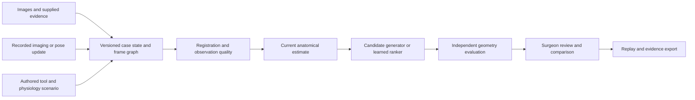

# RessectionLab: a Medivis-relevant project blueprint

October 6, 2026. Research and implementation proposal; nothing in this plan has been implemented or benchmarked by this review. Clinical basis: [operative research dossier](glioma-operative-research-dossier.md). Existing results remain authoritative in [PROJECT_STATUS](../PROJECT_STATUS.md).

## 1. Recommended project thesis

**Build an inspectable glioma planning and rehearsal engine that updates its anatomical estimate from new evidence, identifies which previous plan assumptions no longer hold, and compares revised options under explicit uncertainty.**

For a medical-imaging/ML engineering portfolio, make one real-data anatomical-update experiment the headline. Add a bounded tool/complication rehearsal as a second demonstration. Whole-body physiology and fully deformable bimanual surgery are later modules. This ordering reflects the newly stated hiring objective; the earlier hemostasis-first recommendation remains appropriate for a project primarily aimed at instrument/team training.

The clinician question is: “Given what we know at this point, what changed, what remains uncertain, and which options need reassessment?” The engineering question is: “Can the system preserve spatial correctness and evidence identity while providing a useful, measured update quickly?” Both are more testable than predicting the outcome of an entire hypothetical operation.

The project may ultimately contribute to patient outcomes through better recognition and decisions. Its initial measurable claims should concern anatomy, plan validity under a model, latency and user task performance. No virtual removal score should be described as expected survival or neurological benefit.

## 2. Verified Medivis context and the fit

Official pages were checked on October 6, 2026. Some page opens failed, so Studio details below use its indexed official product text. These are public descriptions; internal architecture, SDK access and engineering priorities remain unverified.

| Public surface | Documented role | Proposed complementary contribution |
|---|---|---|
| [Studio](https://www.medivis.com/studio) | Imaging, segmentation, 3D reconstruction, planning, MPR/fusion, saved trajectories and PACS-connected workflows | Consume reviewed case objects and return an inspectable comparison/update record; another standalone viewer is insufficient differentiation |
| [Cranial Navigation](https://www.medivis.com/navigation/cranial) | Patient registration, tracked instruments and planned trajectories on workstation/AR displays | Research replay of pose/frame validity, anatomy changes and reasons to re-evaluate a plan |
| [Frontier Agents](https://www.medivis.com/frontier/agents) | A research harness assembles case context and invokes validated tools; the model proposes actions | Small deterministic analysis tools with typed inputs, bounded execution and evidence-backed outputs |
| [Frontier Robotics](https://www.medivis.com/frontier/robotics) | Research on supervised tasks using existing registration/tracking and surgeon-approved plans | Virtual fixtures, complete-tool clearance and replayable constraints as research outputs, without claiming robot execution |

The [FDA database](https://www.accessdata.fda.gov/scripts/cdrh/cfdocs/cfPMN/pmn.cfm?ID=K231897) records NeuroAlign's K231897 decision on October 21, 2025. Its [510(k) summary](https://www.accessdata.fda.gov/cdrh_docs/pdf23/K231897.pdf) describes that device's particular boundary, including no integration with intraoperative microscopes/ultrasound. Do not combine broad platform advertising with this device record to imply a cleared brain-shift or live-ultrasound workflow. Proposed ultrasound updates here are an independent research capability; a future integration requires the actual applicable product/interface agreement.

No public Medivis API/SDK contract was verified. Use open formats and a mock external adapter, with no claim that Medivis supports it. A portfolio can demonstrate architectural fit without pretending to be a shipped plug-in.

The current [Senior Robotics Engineer posting](https://www.medivis.com/careers/senior-robotics-engineer) emphasizes coordinate frames, tracking, calibration, latency, measured accuracy, supervised operation, C++/Python and hands-on robotics experience. Those themes justify prioritizing measurable spatial engineering. The role also asks for substantial shipped-robot experience; this software project alone does not establish that experience. For imaging/ML or general engineering opportunities, present the work as evidence of relevant skills rather than assume an unlisted vacancy or hiring guarantee.

## 3. What an impressive demonstration would show

Proposed five-minute demo, contingent on successful implementation and evaluation:

1. **Open an identified public research case.** Display original imaging, supplied or reviewed structures, physical axes and unavailable evidence. Show how a target/trajectory is selected and reviewed.
2. **Inspect the original candidate.** Render the whole instrument, its clearance assumptions, target compartment and source state. Expose why one alternative was rejected. Separate geometric feasibility from clinical acceptability.
3. **Advance to an actual intraoperative observation.** Load the recorded update at its permitted time. Show the new source, registration proposal, retained-tissue coverage and disagreement with the preoperative estimate.
4. **Re-evaluate the old candidate.** Clearly mark stale results before work completes. Show changed contacts/clearance, unknown regions and where a comparison cannot be made. A rejected or uncertain registration produces an honest refusal to publish a revised plan.
5. **Compare revised options.** Present separate residual/coverage/exposure/runtime quantities. Permit the surgeon to inspect and accept, edit or reject a research candidate; do not automatically replace their plan.
6. **Open the evidence record.** Show measured registration errors, latency distributions, included/excluded cases, baseline comparisons, model/version hashes and one genuine failure case.

Then, optionally, show a short **authored** complication scenario: aspiration, blood obscuring the field, bipolar action, and persistent concern about local vessel patency. Its purpose is to demonstrate sequential decisions and observation limits. It must be visibly distinguishable from the real-patient observational replay.

The hiring evidence is the coherent end-to-end behavior and defensible measurement. A polished clip supports it; synthetic vital signs and a large network are not substitutes.

## 4. Three experiment types that must remain distinct

| Experiment | What changes | What it can establish | What it cannot establish |
|---|---|---|---|
| Retrospective observation replay | Real recorded imaging/observations appear in chronological order | Reconstruction/update error and model-conditioned plan changes under observed anatomy | What an unperformed sequence of cuts would have made the later scan look like |
| Geometric planning | Declared rigid/source-cell anatomy and hypothetical tool sequences | Removal/contact/clearance under those assumptions | Living-tissue forces, ischemia or neurological outcome |
| Interactive scenario simulation | Authored dynamics respond to actions | Software behavior, task learning and sensitivity within the declared simulator | Patient generalization or clinical action-response unless independently validated |

Do not splice them into a single false counterfactual. Once a simulated tool sequence differs from the real operation, a subsequent clinical scan is not the observation generated by that sequence. Likewise, public imaging snapshots do not support requesting arbitrary future ultrasound at arbitrary times. Observation-scheduling policies initially belong to an explicitly simulated task.

## 5. Architecture: reuse the application, extend its contracts

Retain Electron/React/TypeScript and the Python sidecar. Current `core.py` and `imaging.py` already represent physical frames/provenance; native geometry and independent replay remain valuable. The renderer already withholds stale sources and superseded replay responses. Extend these patterns rather than replace the stack or move numerical truth into the renderer.

Recorded evidence and authored scenario events must carry different provenance all the way through that graph. The diagram is proposed architecture, not a claim about current implementation.

### Proposed components and ownership

| Component | Responsibility | Existing starting point |
|---|---|---|
| `CaseTimeline` | Immutable observations, availability times, source identities and review status | `core.py`, `imaging.py`, current case/source hashes |
| `FrameGraph` | Explicit transform direction, units, timestamps, calibration and anatomical version | Existing RAS/LPS conversions and geometry contracts |
| `StateEstimator` | Rigid/deformable update proposals, coverage and uncertainty; no silent acceptance | RESECT comparison and ReMIND registration research |
| `PlanValidity` | Invalidate/recompute affected results when their inputs change | Existing selection, preflight and replay identity checks |
| `CandidateService` | Bounded search plus optional learned proposal ranking | Native-axis proposals/search and spatial policy |
| `EpisodeDynamics` | Optional persistent tools, action duration, visibility and complications | New separately versioned task; preserve old `MacroAction` semantics |
| `IndependentEvaluator` | Check geometry and endpoint accounting from exported primitives | Existing evaluation and native replay modules |
| `ReviewUI` | Explain changes, compare options, show missing evidence, collect clinician decisions | Current MPR/3D, comparison and replay UI |
| `ExternalAdapter` | Open-format import/export and simulated tracked-pose stream | New adapter boundary; no assumed proprietary Medivis interface |

### Minimum new data contracts

An observation needs `case_id`, `observation_id`, `source_ids`, `acquired_at`, `available_at`, `frame_id`, `modality`, `spatial_coverage`, `quality`, `evidence_class` and `review_state`.

A transform needs named source/destination frames, direction, units, timestamps, rigid matrix or displacement field, support mask, method/version, evidence used and evaluation status. Coordinate-convention conversion, patient-to-tracker registration and nonrigid tissue displacement are different edges. Store transform uncertainty only with an explicit definition; scalar RMS is not a spatial covariance field.

A candidate needs input-state identity, target definition, complete tools, sequence, allowed evidence, constraints, stop conditions and separate outcome quantities. Its status should distinguish proposed, under review, evaluated under a named model, stale and unavailable. Avoid a global “safe” badge.

A dynamic action additionally needs tool/hand, pose transition, activation, settings, duration and preconditions. A response needs resulting state ID, observation events, physical units and cumulative accounting. Long actions can be interrupted by events; “STOP” cannot erase an evolving complication.

### Important numerical details

- A registration through removed tissue is not a correspondence. Mask cavities and unsupported anatomy; do not use a globally smooth warp to fabricate tissue in a cavity.
- Distinguish forward point transforms from inverse image-sampling transforms, including interpolation and voxel-center conventions.
- Brain-shift fields require nonrigid validity checks; the old rigid collision certificate cannot simply be retained after deformation.
- Recompute or explicitly invalidate annotations and candidate evaluations dependent on a changed transform. Keep older versions inspectable.
- Track real acquisition timing and simulated time separately from wall-clock compute time.
- Treat instrument tracking loss, stale timestamps, wrong-case results and calibration changes as observable application states.
- Keep preview/graphics meshes separate from quantitative geometry, and disclose resolution-dependent small-vessel/tool limitations.

## 6. Data strategy: a real experiment the available data can support

[RESECT](https://aapm.onlinelibrary.wiley.com/doi/10.1002/mp.12268) provides preoperative MRI and intraoperative ultrasound in 23 low-grade-glioma cases, with landmarks where available. [RESECT-SEG](https://pubmed.ncbi.nlm.nih.gov/39047165/) adds relevant annotations. [ReMIND](https://www.cancerimagingarchive.net/collection/remind/) contains 114 released brain-tumor cases with pre/intraoperative imaging; it is not a glioma-only cohort. Use pathology and availability metadata rather than assuming all cases are interchangeable.

[ReMIND2Reg 2025](https://arxiv.org/abs/2508.09649) defines a post-resection MRI–ultrasound registration benchmark with 99 training, five validation and ten private test cases, and landmark-error/robustness/runtime evaluation. This is an existing research benchmark, not an unoccupied novelty claim. Verify current challenge access, licenses and actual release contents before selecting data. Do not treat training images as containing released landmark supervision they do not have.

The repository already contains a negative ReMIND rigid attempt and RESECT conditional-displacement infrastructure. Preserve those results and the current patient/landmark roles. The first selected development case must have eligible observations and a declared evaluation split; do not inspect sealed landmarks while making it work. Training on one public release and testing on a derivative of the same patient is leakage.

No currently inspected dataset establishes synchronized instrument forces, vessel patency, thermal injury, anesthesia interventions and long-term function for every operation. The full surgical world model therefore cannot be learned just by combining public MRI collections. Tool-response claims require targeted physical measurements; neurological causal claims need a different clinical evidence program.

## 7. ML and simulation: one contribution at a time

### Main contribution: reliable anatomical updating

First reproduce an appropriate non-learning baseline on the chosen task: no update, verified rigid alignment, and the existing observation-conditioned interpolation baseline where its inputs apply. A landmark-conditioned task and image-only registration task are different comparisons; every method in a comparison must receive the same permitted observations.

Only then add one justified candidate, such as an established deformable registration approach or a compact learned correction/quality model. A supplied pre-trained model must be audited for training overlap and tested in the actual modality/operative domain. Do not assume a preoperative brain-registration network is valid after tissue removal.

The useful output is an updated field **plus where it is unsupported**. Inspect task-relevant landmark error, tail failures, retained-tissue coverage and candidate-evaluation stability. A lower intensity-registration objective is not independent anatomical accuracy. Confidence needs held-out error/abstention evaluation; a network's variance is not automatically calibrated.

### Second contribution: faster candidate proposals

The current saved comparison already gives a useful question: can a learned ranker retain the observed online-cost benefit while closing the quality gap to search? Search currently wins geometric return in four completed development comparisons, and two other prescribed cases remain blocked. The learned policy and search also have different input representations. [Saved comparison](../artifacts/prepared-training-planner-comparison-v2/RESULT.md).

Improve the observation/action contract before increasing model size. Compare common-information search, imitation/ranking and optional policy refinement using actual time and preview budgets. Report end-to-end preparation, inference, geometric checking and audit costs. If a learned proposal fails evaluation, expose the failure and use the stated fallback; fallback performance belongs in the measured system result.

### Third contribution: information-aware RL

Use RL only after the task contains a meaningful sequential tradeoff: clear the view, inspect a region, request mapping, switch tool, reconsider, or finish. A recurrent policy can use history; a duration-aware environment avoids treating a brief probe and a long maneuver as identical time steps. Compare it with scripted control, observation-aware search and imitation. Start with one modest algorithm rather than a model sweep.

Train/evaluate on separate cases and separate scenario parameters. Distinguish variation within one authored simulator from robustness across independently justified simulator models. The actor cannot see hidden vessel maps, future observations or a perfect action mask that discloses unseen anatomy. An oracle planner is a labeled ceiling, not the practical baseline. Training reward based on latent state must not become deployment-inaccessible input.

The reward may combine declared research preferences, but evaluation should retain separate constraints and endpoints: removal by compartment, non-target exposure, modeled vessel events, missing evidence, recovery, elapsed time and information cost. A major modeled injury cannot be silently compensated by enough removal. If stopping immediately wins, diagnose the task/reward rather than reward reckless continuation.

## 8. Surgical simulator fidelity ladder

| Level | Implementable scope | Claim allowed after corresponding checks |
|---|---|---|
| Geometric | Existing source-cell removal and full-tool motion | Model-conditioned geometry |
| Event/state | Distinct tool actions, time, blood/visibility, authored monitoring and response | Reproducible decision scenarios |
| Calibrated local physical response | Suction, aspiration, thermal or retraction models measured in a suitable setup | Physical agreement within measured conditions |
| Integrated patient rehearsal | Reviewed anatomy with validated observation updates and scoped interactions | Rehearsal usefulness if users demonstrate it |
| Clinical decision benefit | Prospective intended-use evaluation | Only the benefit actually measured |

A compact fluid model and vessel graph are enough to investigate authored field-management scenarios; full computational fluid dynamics is unnecessary initially. A surface/voxel abstraction can handle a declared cavity task before an expensive deformable solver. Later, [LapGym](https://jmlr.org/papers/v24/23-0207.html) offers a SOFA-based surgical-RL architectural reference. Its laparoscopic environments do not validate brain cutting. Existing FEBio work should retain its separate physical-validation gates rather than block the imaging demonstration.

For vitals, start with stable physiology in the main navigation demo. Add a scenario model only when the user's decisions interact with physiology; consider [Pulse's hemorrhage model](https://pulse.kitware.com/md__hemorrhage.html) for systemic coupling. Include local ischemia despite stable systemic values, and uncertain monitoring despite preserved tissue, as distinct cases. A fabricated waveform is presentation, not a physiology result.

## 9. Interoperability without pretending to have integration

Propose three adapter boundaries:

1. **Imaging/evidence:** DICOM imaging and segmentation where supported, with NIfTI research import preserved. DICOM SEG carries referenced-image/frame relationships; a mesh alone loses much of that meaning. [DICOM Segmentation IOD](https://dicom.nema.org/medical/dicom/current/output/chtml/part03/sect_A.51.html).
2. **Spatial state:** explicit registration objects or an internal equivalent, preserving source/destination frames and matrix order. [DICOM Spatial Registration](https://dicom.nema.org/medical/dicom/current/output/chtml/part03/sect_C.20.2.html).
3. **Tracked-pose replay:** a local mock stream, optionally using [OpenIGTLink's documented messages](https://github.com/openigtlink/OpenIGTLink/blob/master/Documents/Protocol/index.md), with timestamps and dropout. This would demonstrate a general research interface, not establish Medivis compatibility.

Return typed candidate geometry, evidence/uncertainty summaries and replay references. Do not invent a DICOM encoding for a complex plan: select and validate actual supported objects or keep a clearly documented research bundle. No PACS connection or patient-data upload is needed for the portfolio demonstration.

A future agent-facing API can expose deterministic operations such as `inspect_case`, `propose_registration`, `evaluate_candidate`, `compare_candidates` and `export_evidence`. An LLM may explain outputs or request these operations; it must not calculate hidden geometry, fabricate anatomical evidence or silently approve a plan. These are proposed local contracts, not Medivis endpoints.

## 10. Ordered implementation milestones and acceptance

Effort depends on data readiness and the role being targeted. These are gates, not promised calendar dates. Serialize work in the existing primary checkout; no worktrees or branch switches are needed for this plan.

| Milestone | Concrete deliverable | Acceptance evidence | If it fails |
|---|---|---|---|
| 1. One observed update | Existing eligible development case with baseline and later observation, explicit transforms and coverage | Correct frame/direction handling and independent anatomical measurements; preserve current negative attempts | Resolve data/frame/registration bottleneck, not a larger network |
| 2. Update-aware review | Original candidate remains inspectable; changed anatomy invalidates stale evaluations; recalculation is cancellable | Wrong-case, delayed-response, changed-calibration and removed-tissue scenarios behave correctly | Narrow the supported workflow and expose missing evidence |
| 3. Strong baseline comparison | Fixed task, same information, one baseline suite and one candidate | Per-case error/coverage, tail failures, runtime and memory; no success-only denominator | Publish negative result and strongest working baseline |
| 4. One ML improvement | Learned update-quality or candidate-ranking component, chosen from measured bottleneck | Incremental benefit on untouched eligible patients or honestly labeled development evidence | Retain search/classical method; do not force an RL claim |
| 5. Tool-decision scenario | Persistent aspiration/bipolar actions, fluid accounting, visibility and local vessel state | Scenario invariants and expert content review; no invented clinical rates | Keep it an authored software demonstration |
| 6. Hiring presentation | Runnable local demo, concise technical report, architecture diagram, benchmark and failure gallery | Another engineer can reproduce the central result and understand its limits | Reduce scope until reproducible |

Software targets should be explicit: responsive UI/cancellation, bounded work queues and memory, deterministic recorded replay and failure recovery. A proposed UI acknowledgement target of 100 ms is a product target, not a measured result or clinical tolerance. Measure end-to-end latency distributions on the actual machine before promising real-time processing. Do not let a planned performance target become a claimed benchmark.

## 11. Evaluation that an engineer can inspect

| Claim | Primary evidence | Common false positive to exclude |
|---|---|---|
| Anatomy update helps | Independent landmark error on retained tissue, paired baseline difference, coverage and tail error | Optimizer similarity improves while anatomy does not |
| Plan evaluation updates correctly | Independent complete-tool replay on the accepted current state | Old certificate survives a changed transform or cavity |
| ML saves useful time | End-to-end quality/time tradeoff including verification and fallback | Reporting network forward time while excluding geometry/preparation |
| RL learns a better policy | Repeated-seed, same-information comparison on unseen tasks/parameters/patients as appropriate | Hidden-state leakage, future scans or altered rewards |
| Complication task is coherent | Fluid conservation, time/delay behavior, local patency versus visible bleeding, observable signals | Rewarding a dry field after vessel destruction |
| Surgeons find it useful | Prespecified review task versus usual image review, blinded adjudication where feasible | Attractive render or high realism rating alone |

Do not tune on final evaluation cases. Keep all acquisitions/derivatives from one patient together, and check overlap across public releases. Do not bootstrap thousands of correlated landmarks or frames as independent patients. If clinical sample size is small, show individual cases and uncertainty rather than pseudo-precise population claims.

A small formative clinician group can identify wrong abstractions and workflow friction; it cannot validate clinical efficacy. Useful tasks include spotting an unreliable overlay, recognizing unavailable evidence, explaining why an option changed, and deciding whether further information is needed. Measure time, meaningful errors and understanding, not just preference.

## 12. Portfolio package and next implementation choice

Prepare one clear project page or README after the demonstration works: a short video, an architecture figure, the permitted claim, a reproducible command, a small benchmark table and a failure case. Include a concise account of an error caught by independent evaluation and how the system responds to a stale/missing input. Show the existing quality-versus-runtime tradeoff honestly. Do not advertise a synthetic neurological improvement or borrow a competitor's clearance/branding.

A defensible pitch is: **“I built a patient-specific glioma research workspace that keeps imaging, instrument geometry and plan evaluations consistent as new observations arrive. It exposes where the evidence is insufficient and compares classical and learned methods under the same constraints.”** Replace the future-tense portions only as the corresponding work is completed.

The next implementation task should be **one real observed-anatomy update feeding independent re-evaluation of an existing candidate**, with a visible rejection path when registration is unsupported. That creates a coherent bridge between the current application, the operative workflow, the available data and Medivis's publicly described navigation/agent architecture. Tool realism and physiology then become bounded extensions with their own measured claims.
