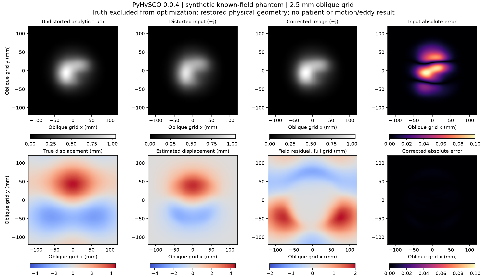

# PyHySCO 0.0.4 physical-phantom experiment

Executed locally October 4, 2026. The same-grid synthetic test recovered known distortion and the external adapter preserved its physical coordinates. **The BTC patient's 0.8-degree AP/PA PE mismatch remains unsupported. No patient correction was run, and this experiment provides no motion, eddy-current, outlier or tract validation.** The zero-distortion test also exposed a solver line-search failure, despite finite identity outputs.

Subsequent independent work in [the physical-vector phantom study](vector-susceptibility-phantom.md) adds a checked analytic identity branch and tests a new native-grid, general-direction prototype. The original PyHySCO failures below remain unchanged; the follow-up does not modify patient acceptance or make this one-axis release represent nonparallel PE vectors.

## Reproducible scope and runtime

`scripts/experimental_pyhysco_phantom.py` constructs synthetic images only; it has no patient-image input. The optional tool was installed with `--no-deps --target data/optional-runtimes/pyhysco-0.0.4`. Its Python code is never imported into the app or evaluator. The driver calls a separate Python process, validates every installed Python source against the reviewed wheel, and enforces its SHA-256:

```text
PyHySCO-0.0.4-py3-none-any.whl
589e6509602b98b5f275d6e772c8ead8c8641ed1f4f20e2e24efaefb022bd884
```

The [0.0.4 distribution](https://pypi.org/project/PyHySCO/0.0.4/) declares GPL-3.0; the [author's license, section 2](https://github.com/EmoryMLIP/PyHySCO/blob/bff665515231bfbd53165e8e18cfdc9c7fe38cf8/LICENSE) permits private execution. The wheel and installed GPL code are ignored local files and are not embedded in the Mac app, model, repository artifacts, or app dependencies. This narrow experiment does not establish a distribution arrangement. The [primary paper](https://www.frontiersin.org/journals/neuroscience/articles/10.3389/fnins.2024.1406821/full) motivates the method; the measurements below come from this actual local run.

The existing Python environment supplied Torch 2.14.1, nibabel 5.4.2 and SciPy 1.18.1. CPU execution was constrained to two OpenMP/BLAS threads, float32, 25 maximum Gauss–Newton iterations, alpha 300, beta 0.0001 and Jacobian intensity correction. The 90-second per-case watchdog samples child RSS approximately every 0.1 seconds and kills the process group above 8 GiB. RSS is a sampled maximum, not a guaranteed high-water measurement. No FSL command, GPU execution, new paid resource or patient correction was involved.

With the pinned wheel already acquired, reproduce from the repository root:

```sh
.venv/bin/python -m pip install --no-deps \
  --target data/optional-runtimes/pyhysco-0.0.4 /path/to/PyHySCO-0.0.4-py3-none-any.whl
.venv/bin/python scripts/experimental_pyhysco_phantom.py \
  --wheel /path/to/PyHySCO-0.0.4-py3-none-any.whl \
  --output outputs/pyhysco_phantom/new-run
.venv/bin/python -m pytest tests/test_pyhysco_phantom.py -q
```

The output directory must not already exist. The completed measurement used `outputs/pyhysco_phantom/v1-r2`; original generated inputs, truth and raw/adapted outputs remain there. Small reviewable records, solver logs, all 33 generated-volume hashes and a visually inspected figure are retained in `artifacts/pyhysco-phantom-v1/`. The executable source hash and predeclared parameter/acceptance record are in `frozen-config.json` before any solver run.

## Forward model and evaluation separation

The analytic object is a compact smooth envelope with three unequal Gaussian structures, sampled on a 96 × 96 × 60 left-handed oblique grid with 2.5 mm spacing. It is not a clinical brain. Obliquity combines 17, −10 and 8 degrees about three axes, with nonzero world origin. The paired acquisition uses either that identical grid or a second prescription rotated 0.8 degrees in the image plane about the same physical center.

A smooth scalar displacement field in millimeters is evaluated in physical coordinates, with amplitude parameter 4 mm. For PE unit vector `p`, the forward map is `y = x + d(x)p`; a Newton solve finds `x` for each observed coordinate. The observed density is the analytic undistorted density divided by `1 + grad(d)·p`. The two signs are generated independently, including each native grid's own physical PE direction. Inverse residuals were below 3e−15 mm and all simulated Jacobians were positive. This uses an analytic NumPy forward model rather than the tool's image interpolator to synthesize truth.

The solver receives only the two distorted images and fixed hyperparameters. Truth is stored in a separate evaluation directory; it is absent from the solver command and its optimization objective. Evaluation support is predeclared as truth intensity above 5% of its peak. Relative image RMSE is `norm(corrected−truth)/norm(truth)` over that support, averaged across both signs. Field RMSE uses the same support. These are single-phantom numerical checks, not clinical error estimates or independent population validation. No hyperparameter search occurred.

## Measured results

| Case | Mean image relative RMSE before → after | Displacement RMSE | Minimum estimated Jacobian | Wall time | Sampled peak RSS | Interpretation |
|---|---:|---:|---:|---:|---:|---|
| Zero distortion | 2.49e−8 → 4.11e−8 | 0 mm | 1.0000 | 4.14 s | 408.8 MiB | Finite identity output; rejected because solver logs NaN/failed line search |
| Same-grid known distortion | 9.6788% → 0.4032% | 0.3948 mm | 0.8865 | 9.34 s | 415.2 MiB | Synthetic numerical contract passed |
| Rotated, regridded negative control | 9.6792% → 0.4058% | 0.3938 mm | 0.8863 | 7.94 s | 415.7 MiB | Numerical improvement does not override unsupported PE geometry; rejected |

The known-field zero-displacement baseline RMSE was 2.2420 mm. Comparing the estimated field to the **wrong sign** gives 4.1744 mm RMSE, supporting the recorded sign convention. The field output represents signed displacement in millimeters along the first grid's `+j`, not calibrated hertz. Both phantom signs are opposite the naming convention of BTC's AP `j-`/PA `j`; transporting each physical direction consistently is what matters.

The smooth, low-amplitude rotated phantom's omitted transverse displacement was at most 0.0612 mm. It is therefore unsurprising that the misspecified one-axis model also gives low image error. This result **does not establish a safe tolerance** for BTC, stronger fields, lesion boundaries, lower SNR or clinical decisions. The strict geometry gate remains closed. Field residuals also remain larger in low-signal background, which is outside the reported evaluation support and visible in the full-grid residual panel.



## Geometry and intensity contracts

1. **Second affine:** a behavioral probe supplies the same second-image array with two different affines. All loader-returned data/domain tensors remain exactly equal, confirming that this release ignores the second affine. The wrapper rejects unequal grids before calling it.
2. **Native prescription:** scalar PA regridding uses `inverse(source_affine) × target_affine`, including orientation and origin. A separate physical linear-ramp test verifies the interpolation against expected world coordinates. Header replacement is not resampling and is never treated as a motion estimate.
3. **PE transport:** the rotated phantom's second direction becomes `[0.0139621803, −0.9999025240, 0]` in the first image basis. Resampling the image does not remove the transverse PE component. Both the native grid mismatch and the transported vector are rejected. An explicitly named synthetic-only negative control bypasses this model gate to measure consequences; there is no patient bypass path.
4. **Image headers:** this PyHySCO release writes identity affines for all outputs. Corrected images retain the reference array shape/order, and the external adapter reinstates its original qform/sform and millimeter units. Persisted corrected-image affines matched the persisted reference exactly.
5. **Staggered field:** the raw field has 97 PE samples for 96 image centers. Its first node is half a PE voxel before the first image center. The adapter gives nodes that derived origin; adjacent-node averaging produces a cell-centered field on the reference affine. A physical-coordinate test confirms node midpoints equal image centers even with obliquity. Field derivatives divide by 2.5 mm before calculating both Jacobians.
6. **Intensity normalization:** PyHySCO first applies `(I−minimum) × scale`. Undoing this after Jacobian modulation requires `corrected/scale + minimum × Jacobian`, with the proper sign for each image. Cubic regridding introduced a small negative boundary overshoot; the adapter preserves the input and correctly restores the normalization rather than clipping or silently dropping the offset.

These contracts cover scalar b0-style images and PE-vector representation. They do not estimate measured head rotations or produce corrected diffusion gradients. Any future diffusion-volume resampling must separately carry gradient rotations and validated motion/eddy provenance.

## Failures retained and remaining gates

The zero-distortion optimization log contains `tensor(nan)` and a failed line search at iteration 1, even though its final field is zero and images remain finite. A zero-gradient early exit in an upstream fix or independently verified wrapper would need its own execution test. The current adapter flags solver warnings and refuses to count that result as accepted correction evidence.

Two early evaluator failures are also retained in `harness-negative-results.json`: a NumPy scalar could not be serialized into JSON, then an overly restrictive zero-intensity-floor assumption rejected the rotated case after cubic regridding. The first was fixed with explicit JSON-native conversion; the second with the Jacobian-aware normalization inverse. Regression tests cover both. Solver parameters, analytic truth and acceptance thresholds remained unchanged; the final run repeated all cases after those fixes.

Fourteen offline tests pass: physical spacing/center/handedness, native and transported PE rejection, direction round trips, shear rejection, full-affine regridding, analytic gradient agreement, invertible density modulation, image/node header restoration, corruption rejection, normalization, wheel integrity and timeout enforcement. CI does not require PyHySCO or import its GPL package. The recorded actual solver run supplies the optional integration evidence.

Patient execution remains gated by unsupported BTC PE geometry, the zero-gradient failure, and the separate full motion/eddy/outlier requirements described in `diffusion-pipeline.md`. A general-vector susceptibility implementation or a verified established correction tool is still needed. The readout discrepancy, separately derived BIDS value and untouched originals remain documented in `btc-acquisition-physics.md`; this millimeter-displacement phantom neither changes those headers nor needs a guessed readout parameter.
